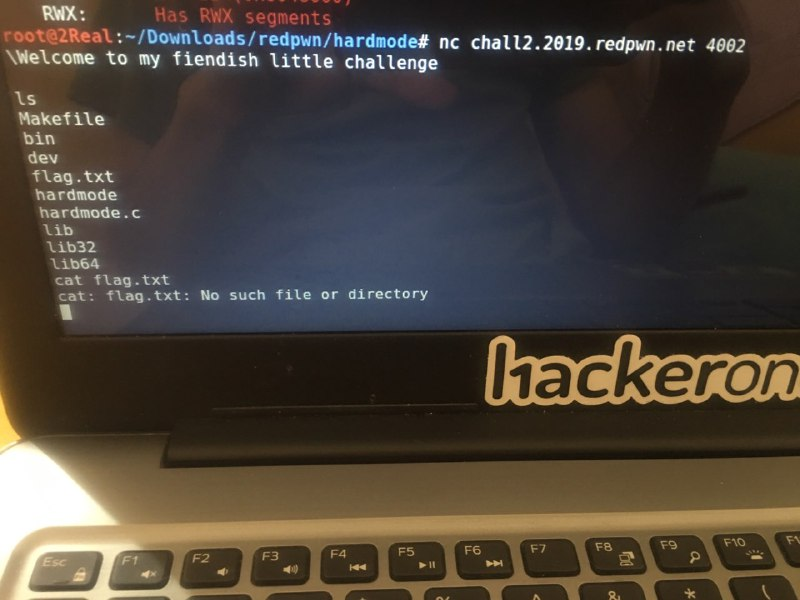

# HARDMODE
```
Written by: blevy

nc chall2.2019.redpwn.net 4002

NB: This challenge does not use the flag{...} format. I accidentally forgot about that whole thing and I'm too lazy to change it.
```
[hardmode.c](hardmode.c) [hardmode](hardmode)

*Got the solution on the Discord Chat*

Just `nc chall2.2019.redpwn.net 4002` , press enter, type `cat flag.txt`, and there is the flag 


Yes, thats is the freaking flag!!!

Is a annoying challenge for me...

## Flag
> cat: flag.txt: No such file or directory